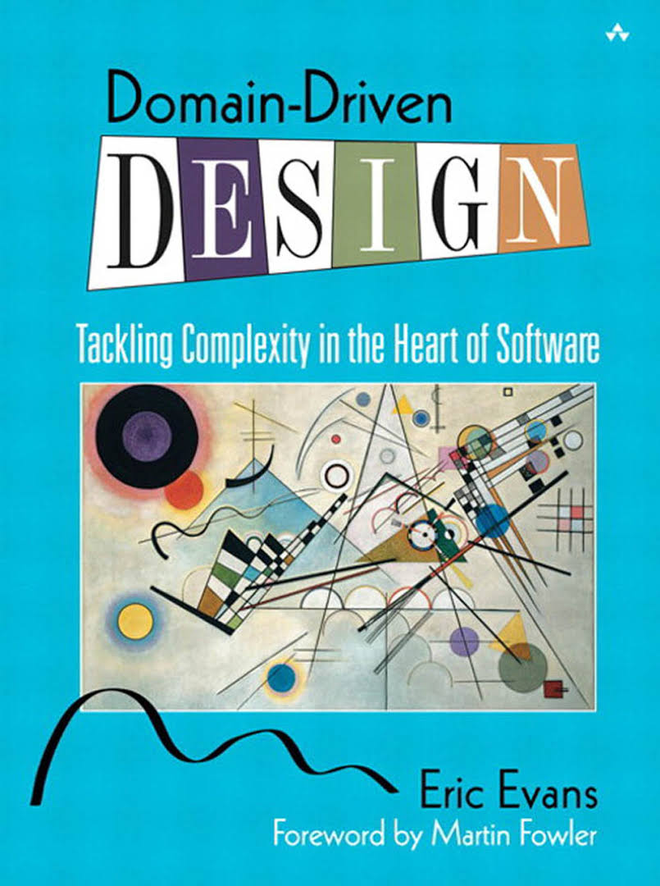
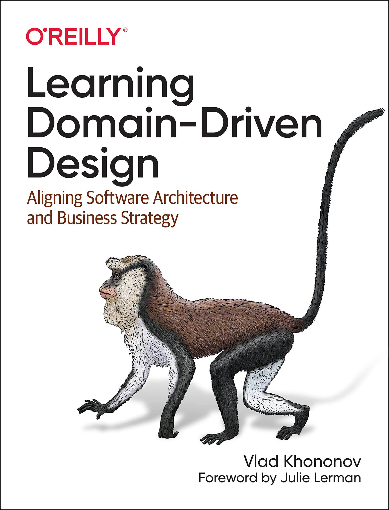

<!--
Personal study notes.
Summarized/paraphrased from:
- Learning Domain-Driven Design (Vlad Khononov)
- Domain-Driven Design: Tackling Complexity in the Heart of Software (Eric Evans)
-->

# Domain-Driven Design (DDD)

Short, structured syllabus for learning DDD (strategic + tactical) and applying it in real systems.

---

## Phase 1 – Foundations & DDD Mindset

> Goal: Understand *why DDD exists* and *how architects think in domains*

### Chapter 1 – What Is Domain-Driven Design?

- Software complexity & business complexity
- Why traditional layered architecture fails
- Knowledge crunch & domain focus
- DDD as a **learning and modeling discipline**
- Role of Domain Experts

---

### Chapter 2 – Domain, Subdomain & Problem Space

- What is a **Domain**
- Core Domain vs Supporting vs Generic Subdomains
- Business value & strategic differentiation
- Problem Space vs Solution Space
- Mapping business strategy to software investment

---

## Phase 2 – Strategic Design (The Heart of DDD)

> Goal: Prevent big-ball-of-mud at system scale

### Chapter 3 – Bounded Context

- What a Bounded Context really is
- Model consistency & semantic boundaries
- One model ≠ one system
- Team ownership & Conway’s Law
- When boundaries fail

---

### Chapter 4 – Context Mapping

- Context Map as a **strategic artifact**
- Relationship patterns:
	- Partnership
	- Shared Kernel
	- Customer–Supplier
	- Conformist
	- Anticorruption Layer
- Evolution of large systems
- Organizational impact

---

## Phase 3 – Tactical Design (Inside a Bounded Context)

> Goal: Build models that are **expressive, correct, and maintainable**

### Chapter 5 – Ubiquitous Language

- Language as a design tool
- Shared mental model
- Code = documentation
- Language evolution
- Aligning business & technical language

---

### Chapter 6 – Building Blocks of a Domain Model

- Entity
- Value Object
- Aggregate
- Aggregate Root
- Domain Service
- Invariants & consistency rules

---

### Chapter 7 – Aggregates & Consistency Boundaries

- Aggregate design rules
- Transaction boundaries
- Invariant protection
- Performance vs consistency trade-offs
- Common aggregate mistakes

---

### Chapter 8 – Repositories & Factories

- Persistence ignorance
- Repositories vs DAOs
- Factories for complex creation
- Lifecycle management

---

## Phase 4 – Application, Integration & Architecture

> Goal: Make DDD work in **real, distributed systems**

### Chapter 9 – Application Layer & Use Cases

- Application Service vs Domain Service
- Orchestration vs business logic
- Command & Query separation
- Transaction management

---

### Chapter 10 – Integrating Bounded Contexts

- Domain Events
- Integration Events
- Anti-Corruption Layer (deep dive)
- Messaging vs synchronous APIs
- Eventual consistency

---

### Chapter 11 – DDD, Architecture & Modern Systems

- Hexagonal / Clean Architecture
- DDD + Microservices (when it works, when it doesn’t)
- DDD with Monoliths
- Scaling teams with DDD
- Tactical DDD vs CRUD systems

---

## Phase 5 – Advanced & Real-World DDD

> Goal: Senior / Architect-level mastery

### Chapter 12 – Strategic Refactoring & Model Evolution

- Big Ball of Mud → DDD
- Strangler patterns
- Evolving models safely
- Dealing with legacy databases

---

### Chapter 13 – DDD in Practice

- When **NOT** to use DDD
- Cost vs benefit analysis
- Team maturity requirements
- DDD adoption roadmap
- Common failure modes in companies